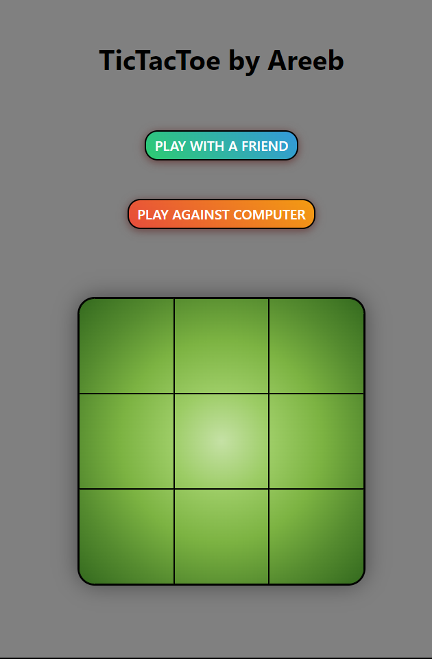
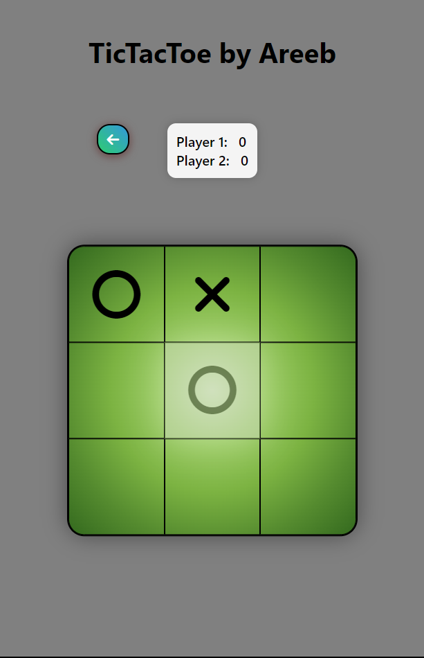
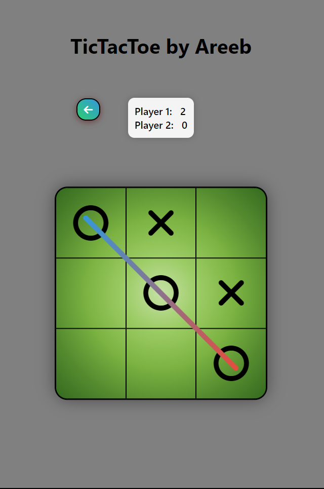
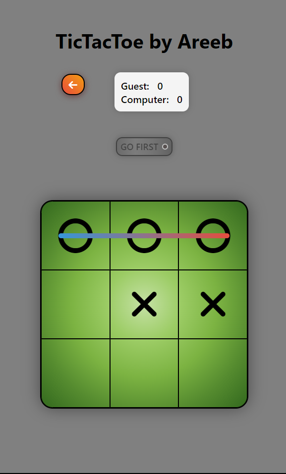

# Tic-Tac-Toe Classic

A classic Tic-Tac-Toe game built with HTML, CSS, and vanilla JavaScript. Challenge your friends or hone your strategic skills against the computer in this timeless game.

## Features

* **Two-Player Mode:**  Play against a friend for classic Tic-Tac-Toe fun.
* **Computer Opponent:** Test your skills against a simple computer AI.
* **Win/Game Over Animations:** Celebrate your victories or try again with dynamic animations.
* **Player Names:** Enter your names to personalize the game experience.

## How to Play

1. **Play Online:** Try the game directly in your browser: https://areebzaho.github.io/TicTacToeGame/

2. **Clone the Repository:** To play locally or contribute, clone the code:
   ```bash
   git clone [https://github.com/AreebZaho/TicTacToeGame.git](https://github.com/AreebZaho/TicTacToeGame.git)

## How to Play (Details)
1. Enter Names (Optional): Personalize your experience by entering player names.
2. Choose Mode: Select to play against a friend or the computer.
3. Take Turns: Click on empty squares to mark them with your symbol ('X' or 'O').
4. Win: The first player to get three of their symbols in a row (horizontally, vertically, or diagonally) wins!

## Screenshots





## Technologies Used
HTML,
CSS,
JavaScript (DOM manipulation)

## Contributions
I'm always learning! Feel free to suggest improvements, fix bugs, or add new features. Open issues and pull requests are welcome.

## Show Your Support
If you enjoyed playing Tic-Tac-Toe Classic, please give the project a **star** on GitHub!

**Let's Play!**
